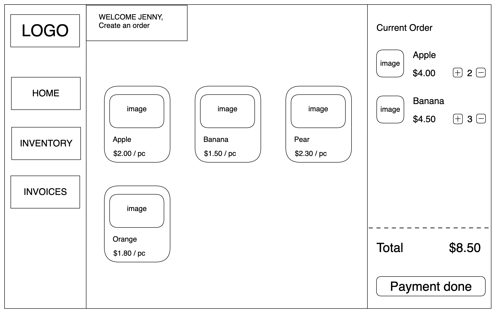
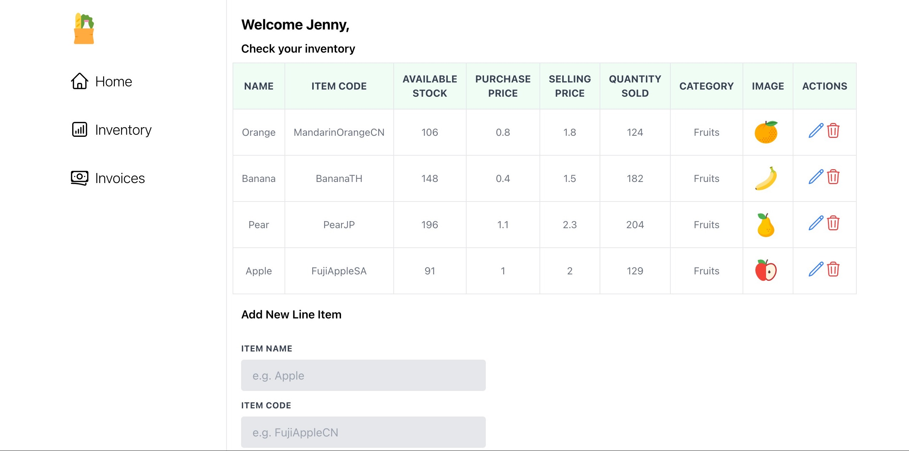

# Point of Sales System

This is a web-based point of sales system that allows users to manage their inventory and sell products to customers. The system includes features such as product management, inventory management, sales tracking, and reporting.

## Table of Contents

1. [User Stories](#user-stories)
2. [Wireframes](#wireframes)
3. [Technologies Used](#technologies-used)
4. [Libraries Used](#libraries-used)
5. [Installation Instructions](#installation-instructions)
6. [Back-end API Endpoints](#backend-api)
7. [Next Steps](#next-steps)

## User Stories

As a store owner, Jenny wants to:

- Add products to a cart
- Remove products from a cart
- Adjust the quantity of a product in a cart
- Calculate the total cost of items in a cart
- Accept payment from a customer
- Add new products to her inventory
- Edit existing products in her inventory
- Remove products from her inventory
- View a list of all products in her inventory
- Update the stock level of a product when a sale is made
- View a list of all sales made

## Wireframes



## Technologies Used

- ReactJS
- Tailwind CSS
- MongoDB
- Express
- Node

## Libraries Used

- react-hot-toast

## Installation Instructions

For client folder:

```
npm install
npm start
```

For server folder:

```
npm install
npm run dev
```

## Screenshots of App

Home Page:


Invetory Page:


Invoices Page:


## Back-end API endpoints

- Orders

  1. Create order
  2. Get all orders
  3. Update order
  4. Delete order

- Stock

  1. Create stock
  2. Get all stock
  3. Update stock
  4. Delete stock

## Next Steps

- Implement login/logout
- Implement protected endpoints
